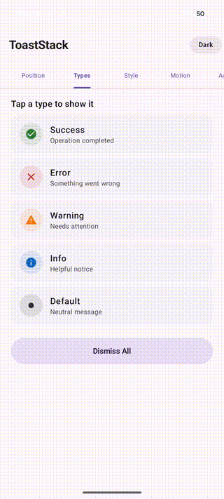
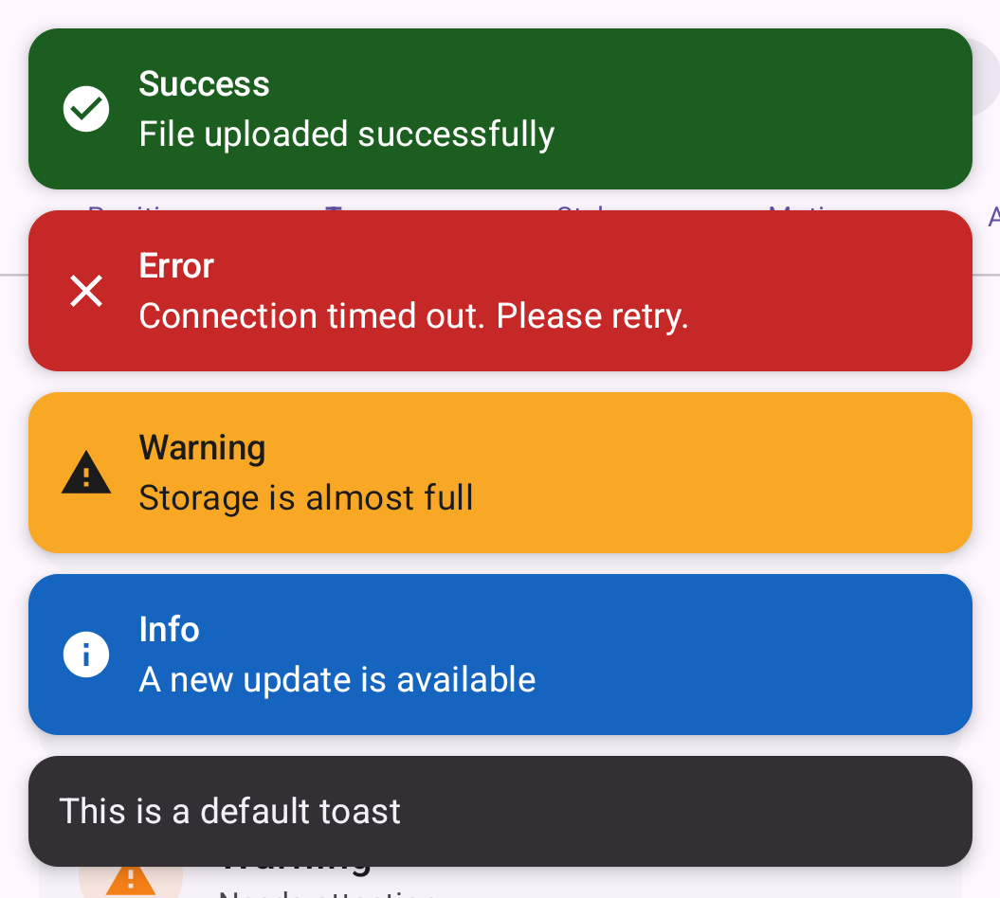
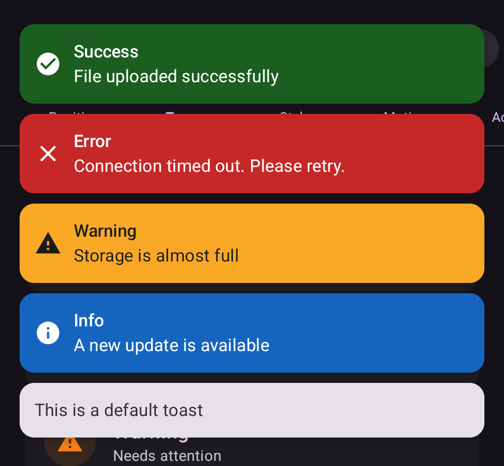
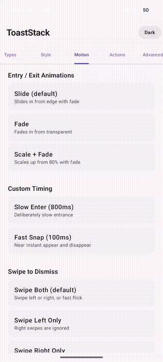
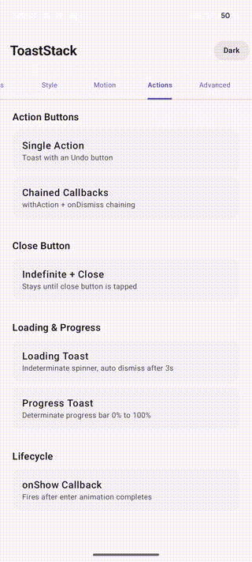
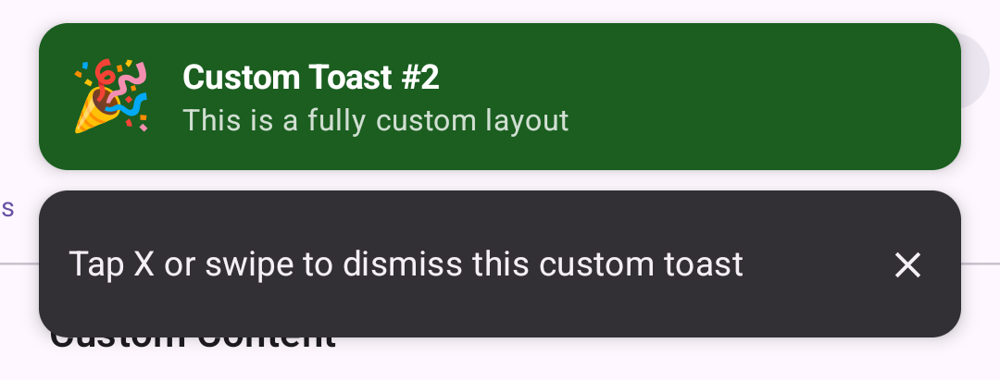

# ToastStack

A modern, Compose native toast and notification library for Android.
No Scaffold required. One liner API. Stackable. Themeable. Animated.

[](https://developer.android.com/about/versions/nougat)
[](LICENSE)



## What is ToastStack?

ToastStack replaces Android's limited native `Toast` and `Snackbar` with a fully featured, Compose native notification system. It works anywhere in your app without requiring `Scaffold`, supports multiple simultaneous toasts with stacking and animations, and provides a one liner API that works from both composables and ViewModels.

## Features

- **6 toast types** - Default, Success, Error, Warning, Info, Loading
- **7 positions** - TopCenter, TopStart, TopEnd, Center, BottomCenter, BottomStart, BottomEnd
- **3 animation styles** - Slide, Fade, ScaleAndFade with configurable duration and easing
- **Action buttons** - Single and secondary actions with auto dismiss
- **Progress toasts** - Indeterminate loading spinner and determinate progress bar
- **Swipe to dismiss** - Configurable direction with velocity based flick detection
- **Custom content** - Arbitrary `@Composable` lambda for fully custom toast layouts
- **Chaining API** - `show("msg").withAction("Undo") { }.onDismiss { }`
- **Suspend support** - `showAndAwait()` suspends until dismissed
- **Kotlin Duration** - `ToastDuration(3.seconds)` for arbitrary durations
- **String resources** - `show(R.string.saved)` with format arguments
- **Builder DSL** - `state.build { message = "..."; type = Success }`
- **ViewModel extensions** - `showToast()`, `showSuccessToast()`, `showToastAndAwait()`
- **Zero setup** - Auto initializer attaches to every Activity, just call `ToastStack.show()`
- **Dark mode** - Adapts automatically via Material 3 theme tokens
- **Haptic feedback** - Optional vibration per toast type
- **Sound** - Optional notification sound with per type customization
- **Accessibility** - TalkBack announcements, type prefixes, reduced motion support, WCAG AA contrast
- **Priority queue** - Low, Normal, High, Urgent with queue overflow handling
- **Duplicate detection** - Suppresses identical messages within a time window
- **RTL support** - Start/End positions mirror correctly
- **Edge to edge** - Respects system bars, display cutouts, and software keyboard

## Screenshots







## Installation

Add JitPack to your project's `settings.gradle.kts`:

```kotlin
dependencyResolutionManagement {
    repositories {
        google()
        mavenCentral()
        maven { url = uri("https://jitpack.io") }
    }
}
```

Add the dependency to your module's `build.gradle.kts`:

```kotlin
dependencies {
    implementation("com.github.zeevy:ToastStack:v0.1.0")
}
```

Or using a version catalog (`libs.versions.toml`):

```toml
[versions]
toaststack = "v0.1.0"

[libraries]
toaststack = { group = "com.github.zeevy", name = "ToastStack", version.ref = "toaststack" }
```

## Quick Start

ToastStack auto initializes. Just add the dependency and show toasts from anywhere:

```kotlin
// One liners from anywhere (ViewModel, callback, service)
ToastStack.success("File saved")
ToastStack.error("Upload failed")
ToastStack.warning("Low battery")
ToastStack.info("Update available")
ToastStack.show("Plain message")
```

That's it. No `Scaffold`, no `SnackbarHostState`, no `setContent` wiring.

### Manual Setup (optional)

If you prefer manual control or need a custom configuration, opt out of auto initialization and place the host yourself:

```kotlin
setContent {
    MaterialTheme {
        Box {
            MyScreen()
            ToastStackHost()
        }
    }
}
```

Or use the wrapper:

```kotlin
setContent {
    MaterialTheme {
        WithToastStack {
            MyScreen()
        }
    }
}
```

## API Overview

### Chaining

```kotlin
ToastStack.show("Item deleted", duration = ToastDuration.Long)
    .withAction("Undo") { restoreItem() }
    .onDismiss { reason -> log("dismissed: $reason") }
```

### Suspend

```kotlin
viewModelScope.launch {
    val reason = ToastStack.showAndAwait(
        "Confirm delete?",
        showCloseButton = true
    )
    if (reason == DismissReason.Action) undoDelete()
}
```

### Title and Description

```kotlin
ToastStack.error(
    "Connection timed out. Please check your network.",
    title = "Network Error"
)
```

### Custom Duration

```kotlin
import kotlin.time.Duration.Companion.seconds

ToastStack.show("Gone in 3 seconds", duration = ToastDuration(3.seconds))
ToastStack.show("Custom millis", duration = ToastDuration.Custom(1500))
```

### Loading and Progress

```kotlin
val handle = ToastStack.loading("Uploading files...")

// Update progress
handle.updateProgress(0.5f, "5 of 10 files")

// Complete
handle.dismiss()
ToastStack.success("Upload complete")
```

### Action Buttons

```kotlin
ToastStack.show("Message sent")
    .withAction("Undo") {
        unsendMessage()
    }
```

### Custom Content

```kotlin
toastState.showCustom(
    duration = ToastDuration.Long,
    showCloseButton = true
) {
    Row(verticalAlignment = Alignment.CenterVertically) {
        Image(painter = painterResource(R.drawable.avatar), ...)
        Column {
            Text("Custom Layout", fontWeight = FontWeight.Bold)
            Text("Any composable content you want")
        }
    }
}
```

### Builder DSL

```kotlin
toastState.build {
    message = "Connection lost"
    type = ToastType.Error
    duration = ToastDuration.Long
    showCloseButton = true
    hapticEnabled = true
    actionLabel = "Retry"
    onAction = { reconnect() }
    onDismiss = { reason -> log(reason) }
}
```

### ViewModel Extensions

```kotlin
class MyViewModel : ViewModel() {
    fun onSaveComplete() {
        showSuccessToast("Document saved")
    }

    fun onError(message: String) {
        showErrorToast(message, title = "Error")
    }

    fun confirmDelete() {
        showToastAndAwait(
            "Item will be deleted",
            showCloseButton = true
        ) { reason ->
            if (reason == DismissReason.Timeout) performDelete()
        }
    }
}
```

### String Resources

```kotlin
ToastStack.show(R.string.file_saved)
ToastStack.error(R.string.upload_failed, fileName)
```

## Configuration

### Global Defaults

```kotlin
val state = rememberToastStackState(
    config = ToastStackConfig {
        maxVisible = 3
        defaultPosition = ToastPosition.BottomCenter
        defaultDuration = ToastDuration.Long
        defaultAnimation = ToastAnimation.Fade
        defaultSwipeDismiss = SwipeDismissDirection.Both
    }
)
```

### Per Toast Styling

```kotlin
ToastStack.show(
    message = "Custom look",
    style = ToastStackStyle(
        backgroundColor = Color(0xFF6A1B9A),
        contentColor = Color.White,
        borderColor = Color.White,
        borderWidth = 2.dp,
        shape = RoundedCornerShape(24.dp)
    )
)
```

### Animations

```kotlin
// Per toast animation override
ToastStack.show(
    "Fade in",
    animation = ToastAnimation.Fade,
    animationConfig = ToastAnimationConfig(
        enterDurationMillis = 500,
        exitDurationMillis = 300
    )
)
```

### Priority Queue

```kotlin
// Normal toasts queue when maxVisible is reached
ToastStack.show("Queued", priority = ToastPriority.Normal)

// Urgent toasts bypass the queue and show immediately
ToastStack.show("Critical!", priority = ToastPriority.Urgent)
```

### Duplicate Detection

```kotlin
val state = ToastStackState(deduplicationWindowMs = 3000)
// Second call within 3 seconds is suppressed
state.show("Same message")
state.show("Same message") // Ignored
```

## Haptic and Sound

```kotlin
ToastStack.show(
    "Feel the vibration",
    hapticEnabled = true,  // Vibrates on appear
    soundEnabled = true    // Plays notification sound
)
```

Haptic intensity varies by type (Error = 80ms, Warning = 60ms, Success = 40ms).
Both features respect system settings (haptic toggle, silent mode, Do Not Disturb).

## Accessibility

- **TalkBack**: Toasts announce with type prefix (e.g., "Error notification: Connection failed")
- **Auto pause**: Auto dismiss timers pause when TalkBack is active
- **Reduced motion**: Animations simplify to a short fade when system "Remove animations" is enabled
- **Color contrast**: All built in types meet WCAG AA 4.5:1 minimum ratio
- **Focus**: Action buttons are focusable and activatable via accessibility services

## ProGuard / R8

Consumer rules are bundled with the library. No additional ProGuard configuration is needed.

## Requirements

- Min SDK 24 (Android 7.0)
- Compile SDK 36
- Jetpack Compose with Material 3
- Kotlin 2.0+

## License

```
Copyright 2026 zeevy

Licensed under the Apache License, Version 2.0 (the "License");
you may not use this file except in compliance with the License.
You may obtain a copy of the License at

    http://www.apache.org/licenses/LICENSE-2.0

Unless required by applicable law or agreed to in writing, software
distributed under the License is distributed on an "AS IS" BASIS,
WITHOUT WARRANTIES OR CONDITIONS OF ANY KIND, either express or implied.
See the License for the specific language governing permissions and
limitations under the License.
```
