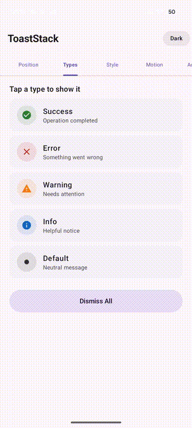
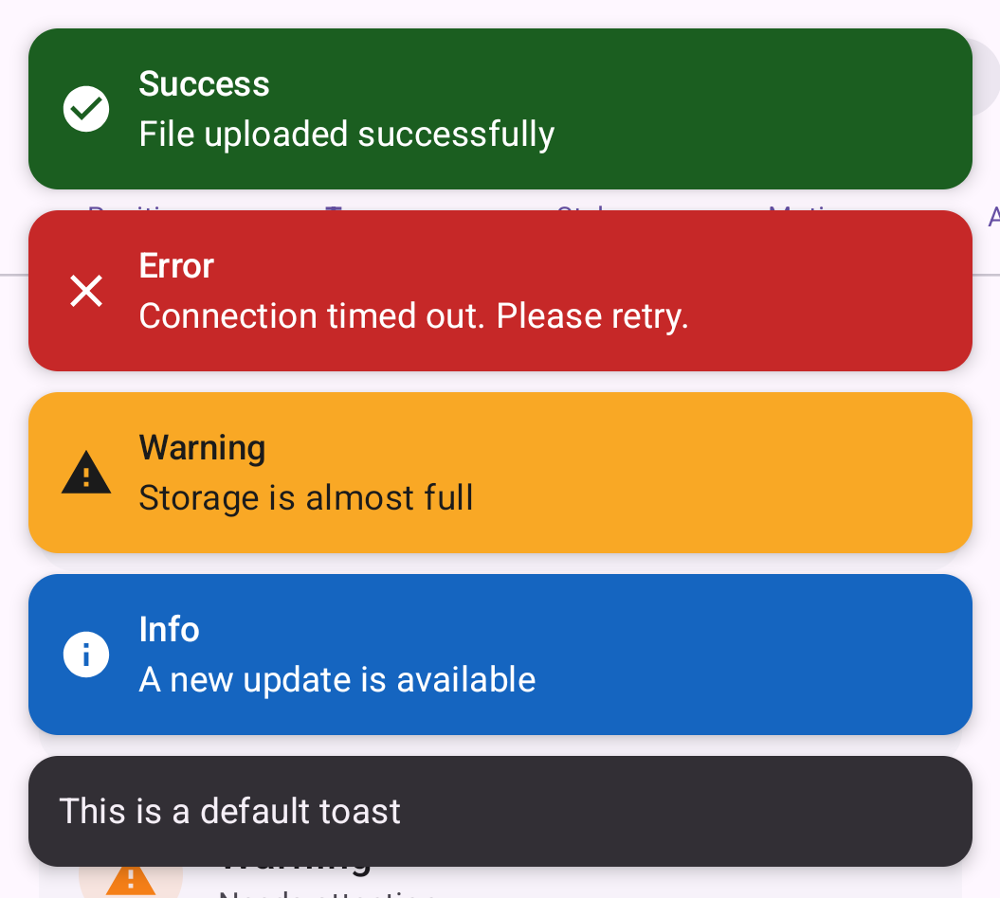
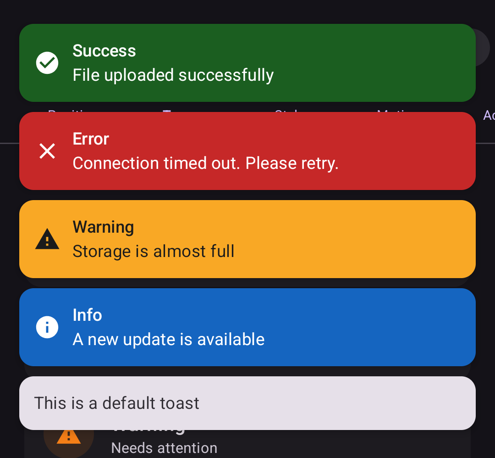
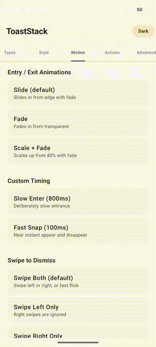
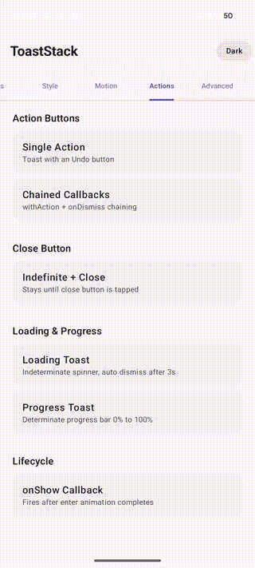
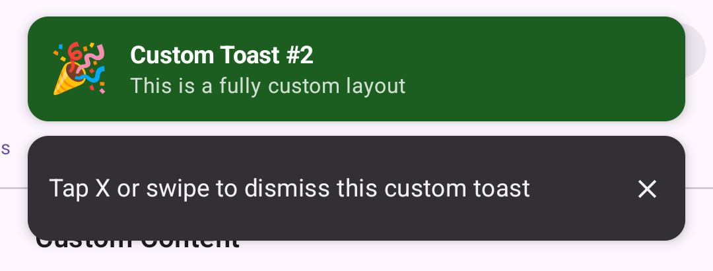

# ToastStack

A modern, Compose native toast and notification library for Android.
No Scaffold required. One liner API. Stackable. Themeable. Animated.

[](https://github.com/zeevy/toast-stack/actions/workflows/ci.yml)
[](https://github.com/zeevy/toast-stack/actions/workflows/codeql.yml)
[](https://jitpack.io/#zeevy/toast-stack)
[](https://developer.android.com/about/versions/nougat)
[](LICENSE)



## What is ToastStack?

ToastStack replaces Android's limited native `Toast` and `Snackbar` with a fully featured, Compose native notification system. It works anywhere in your app without requiring `Scaffold`, supports multiple simultaneous toasts with stacking and animations, and provides a one liner API that works from both composables and ViewModels.

## Features

- **6 toast types** - Default, Success, Error, Warning, Info, Loading
- **7 positions** - TopCenter, TopStart, TopEnd, Center, BottomCenter, BottomStart, BottomEnd
- **3 animation styles** - Slide, Fade, ScaleAndFade with configurable duration and easing
- **Action buttons** - Single and secondary actions with auto dismiss
- **Progress toasts** - Indeterminate loading spinner and determinate progress bar
- **Swipe to dismiss** - Configurable direction with velocity based flick detection
- **Custom content** - Arbitrary `@Composable` lambda for fully custom toast layouts
- **Chaining API** - `show("msg").withAction("Undo") { }.onDismiss { }`
- **Suspend support** - `showAndAwait()` suspends until dismissed
- **Kotlin Duration** - `ToastDuration(3.seconds)` for arbitrary durations
- **String resources** - `show(R.string.saved)` with format arguments
- **Builder DSL** - `state.build { message = "..."; type = Success }`
- **ViewModel extensions** - `showToast()`, `showSuccessToast()`, `showToastAndAwait()`
- **Zero setup** - Auto initializer attaches to every Activity, just call `ToastStack.show()`
- **App theme** - Toasts follow your app's `MaterialTheme` colors, typography and dark mode. Or switch to the library's own fixed colors
- **Haptic feedback** - Optional vibration per toast type
- **Sound** - Optional notification sound with per type customization
- **Accessibility** - TalkBack announcements, type prefixes, reduced motion support, WCAG AA contrast
- **Priority queue** - Low, Normal, High, Urgent with queue overflow handling
- **Duplicate detection** - Suppresses identical messages within a time window
- **RTL support** - Start/End positions mirror correctly
- **Edge to edge** - Respects system bars, display cutouts, and software keyboard

## Screenshots



---



---



---



---



## Installation

Add JitPack to your project's `settings.gradle.kts`:

```kotlin
dependencyResolutionManagement {
    repositories {
        google()
        mavenCentral()
        maven { url = uri("https://jitpack.io") }
    }
}
```

Add the dependency to your module's `build.gradle.kts`:

```kotlin
dependencies {
    implementation("com.github.zeevy:toast-stack:v1.1.0")
}
```

Or using a version catalog (`libs.versions.toml`):

```toml
[versions]
toastStack = "v1.1.0"

[libraries]
toast-stack = { group = "com.github.zeevy", name = "toast-stack", version.ref = "toastStack" }
```

```kotlin
// build.gradle.kts
dependencies {
    implementation(libs.toast.stack)
}
```

## Quick Start

ToastStack auto initializes. Just add the dependency and show toasts from anywhere:

```kotlin
// One liners from anywhere (ViewModel, callback, service)
ToastStack.success("File saved")
ToastStack.error("Upload failed")
ToastStack.warning("Low battery")
ToastStack.info("Update available")
ToastStack.show("Plain message")
```

That's it. No `Scaffold`, no `SnackbarHostState`, no `setContent` wiring.

### Global Configuration (optional)

Customize defaults once in your `Application.onCreate()`. The auto-initializer picks these up when attaching to each Activity:

```kotlin
class MyApp : Application() {
    override fun onCreate() {
        super.onCreate()
        ToastStack.configure(
            defaultPosition = ToastPosition.TopCenter,
            contentPadding = PaddingValues(
                start = 16.dp,
                end = 16.dp,
                top = 98.dp,
                bottom = 8.dp,
            ),
            defaultDuration = ToastDuration.Short,
            maxVisible = 5,
            defaultSwipeDismiss = SwipeDismissDirection.Both,
            defaultAnimation = ToastAnimation.Slide,
            defaultAnimationConfig = ToastAnimationConfig(),
            deduplicationWindowMs = 0, // e.g. 3000 to merge repeats into one card
            globalStyle = null, // or a ToastStackStyle for app-wide look
            colorSource = ToastColorSource.AppTheme,
            theme = { content -> MyAppTheme { content() } },
        )
    }
}
```

All parameters are optional and have sensible defaults. `colorSource` and `theme` reach an overlay that is already on screen. The other values are read when an Activity's overlay is first created, so call `configure()` before any Activity starts.

### Theming

Toast colors come from one of two sources, set with `colorSource`:

- `ToastColorSource.AppTheme` (default): toasts render inside your app theme. Colors and typography come from your `MaterialTheme`, so dark mode, dynamic color and in app theme switches follow automatically. Typed toasts map to Material 3 color roles:

| Type | Background | Content |
| --- | --- | --- |
| Default, Loading | `inverseSurface` | `inverseOnSurface` |
| Success | `primaryContainer` | `onPrimaryContainer` |
| Info | `secondaryContainer` | `onSecondaryContainer` |
| Warning | `tertiaryContainer` | `onTertiaryContainer` |
| Error | `errorContainer` | `onErrorContainer` |

- `ToastColorSource.Library`: the library's own colors. Default and Loading use the baseline Material 3 inverse surface. Success, Error, Warning and Info use fixed green, red, amber and blue.

The auto overlay is a separate Compose tree, so it cannot see your theme by itself. Pass your theme composable as `theme` in `ToastStack.configure()`. If `colorSource` is `AppTheme` and no `theme` is given, the overlay falls back to `Library` and logs one warning. A `ToastStackHost` placed by hand inside your Compose tree already sits under your theme and needs no `theme` parameter.

Two rules for the `theme` wrapper:

- It must only set the theme. Do not put `Surface`, `Scaffold` or any background inside it. The overlay covers the whole Activity, so a background there hides your app's UI. If your theme function wraps `Surface`, pass a version without it, for example `{ content -> MaterialTheme(colorScheme = myScheme, typography = myTypography, content = content) }`.
- Call `ToastStack.configure()` from `Application.onCreate()`. The lambda is kept for the life of the process, so do not capture an Activity, View, ViewModel or Activity Context in it.

Upgrading from 1.0.x: `AppTheme` is the default, so a `ToastStackHost` you place by hand now shows typed toasts in your theme's color roles instead of the fixed green, red, amber and blue. To keep the old look, pass `colorSource = ToastColorSource.Library` to the host or set it in `ToastStack.configure()`.

Material 3 has no success role, so Success uses `primaryContainer`. If you want a green success toast, override it with `globalStyle` or a per toast style. Global style and per toast style still apply on top of either source.

## API Overview

### Chaining

```kotlin
ToastStack.show("Item deleted", duration = ToastDuration.Long)
    .withAction("Undo") { restoreItem() }
    .onDismiss { reason -> log("dismissed: $reason") }
```

### Suspend

```kotlin
viewModelScope.launch {
    val reason = ToastStack.showAndAwait(
        "Confirm delete?",
        showCloseButton = true
    )
    if (reason == DismissReason.Action) undoDelete()
}
```

### Title and Description

```kotlin
ToastStack.error(
    "Connection timed out. Please check your network.",
    title = "Network Error"
)
```

### Custom Duration

```kotlin
import kotlin.time.Duration.Companion.seconds

ToastStack.show("Gone in 3 seconds", duration = ToastDuration(3.seconds))
ToastStack.show("Custom millis", duration = ToastDuration.Custom(1500))
```

### Loading and Progress

```kotlin
val handle = ToastStack.loading("Uploading files...")

// Update progress
handle.updateProgress(0.5f, "5 of 10 files")

// Complete
handle.dismiss()
ToastStack.success("Upload complete")
```

### Action Buttons

```kotlin
ToastStack.show("Message sent")
    .withAction("Undo") {
        unsendMessage()
    }
```

### Custom Content

```kotlin
toastState.showCustom(
    duration = ToastDuration.Long,
    showCloseButton = true
) {
    Row(verticalAlignment = Alignment.CenterVertically) {
        Image(painter = painterResource(R.drawable.avatar), ...)
        Column {
            Text("Custom Layout", fontWeight = FontWeight.Bold)
            Text("Any composable content you want")
        }
    }
}
```

### Builder DSL

```kotlin
toastState.build {
    message = "Connection lost"
    type = ToastType.Error
    duration = ToastDuration.Long
    showCloseButton = true
    hapticEnabled = true
    actionLabel = "Retry"
    onAction = { reconnect() }
    onDismiss = { reason -> log(reason) }
}
```

### ViewModel Extensions

```kotlin
class MyViewModel : ViewModel() {
    fun onSaveComplete() {
        showSuccessToast("Document saved")
    }

    fun onError(message: String) {
        showErrorToast(message, title = "Error")
    }

    fun confirmDelete() {
        showToastAndAwait(
            "Item will be deleted",
            showCloseButton = true
        ) { reason ->
            if (reason == DismissReason.Timeout) performDelete()
        }
    }
}
```

### String Resources

```kotlin
ToastStack.show(R.string.file_saved)
ToastStack.error(R.string.upload_failed, fileName)
```

## Configuration

Global defaults are configured via `ToastStack.configure()` in your `Application.onCreate()` (see [Global Configuration](#global-configuration-optional) above).

### Per Toast Styling

```kotlin
ToastStack.show(
    message = "Custom look",
    style = ToastStackStyle(
        backgroundColor = Color(0xFF6A1B9A),
        contentColor = Color.White,
        borderColor = Color.White,
        borderWidth = 2.dp,
        shape = RoundedCornerShape(24.dp)
    )
)
```

### Animations

```kotlin
// Per toast animation override
ToastStack.show(
    "Fade in",
    animation = ToastAnimation.Fade,
    animationConfig = ToastAnimationConfig(
        enterDurationMillis = 500,
        exitDurationMillis = 300
    )
)
```

### Priority Queue

```kotlin
// Normal toasts queue when maxVisible is reached
ToastStack.show("Queued", priority = ToastPriority.Normal)

// Urgent toasts bypass the queue and show immediately
ToastStack.show("Critical!", priority = ToastPriority.Urgent)
```

### Duplicate Detection

```kotlin
// Global host (auto overlay): set it in Application.onCreate()
ToastStack.configure(deduplicationWindowMs = 3000)

// Or on your own state
val state = ToastStackState(deduplicationWindowMs = 3000)
state.show("Same message")
state.show("Same message") // No new card. The first card shows "Same message (x2)"
```

While the card is still on screen, each repeat within the window restarts its auto dismiss timer and adds one to the count. The same message after the card has gone shows a new card. Pass `showRepeatCount = false` to hide the "(xN)" count.

## Haptic and Sound

```kotlin
ToastStack.show(
    "Feel the vibration",
    hapticEnabled = true,  // Vibrates on appear
    soundEnabled = true    // Plays notification sound
)
```

Haptic intensity varies by type (Error = 80ms, Warning = 60ms, Success = 40ms).
Both features respect system settings (haptic toggle, silent mode, Do Not Disturb).

## Accessibility

- **TalkBack**: Toasts announce with type prefix (e.g., "Error notification: Connection failed")
- **Auto pause**: Auto dismiss timers pause when TalkBack is active
- **Reduced motion**: Animations simplify to a short fade when system "Remove animations" is enabled
- **Color contrast**: All built in types meet WCAG AA 4.5:1 minimum ratio
- **Focus**: Action buttons are focusable and activatable via accessibility services

## ProGuard / R8

Consumer rules are bundled with the library. No additional ProGuard configuration is needed.

## Requirements

- Min SDK 24 (Android 7.0)
- Compile SDK 36
- Jetpack Compose with Material 3
- Kotlin 2.0+

## Contributing

Contributions of any size are welcome. See [CONTRIBUTING.md](CONTRIBUTING.md) for the development setup, coding conventions, and how to run the lint/test suite locally before opening a pull request. By participating you agree to the [Code of Conduct](CODE_OF_CONDUCT.md).

- **Bugs and feature requests**: open an [issue](https://github.com/zeevy/toast-stack/issues) using the templates.
- **Questions and ideas**: start a [discussion](https://github.com/zeevy/toast-stack/discussions).
- **Security reports**: follow the [Security Policy](SECURITY.md) - please do not file public issues for vulnerabilities.

## License

```text
Copyright 2026 zeevy

Licensed under the Apache License, Version 2.0 (the "License");
you may not use this file except in compliance with the License.
You may obtain a copy of the License at

    http://www.apache.org/licenses/LICENSE-2.0

Unless required by applicable law or agreed to in writing, software
distributed under the License is distributed on an "AS IS" BASIS,
WITHOUT WARRANTIES OR CONDITIONS OF ANY KIND, either express or implied.
See the License for the specific language governing permissions and
limitations under the License.
```
